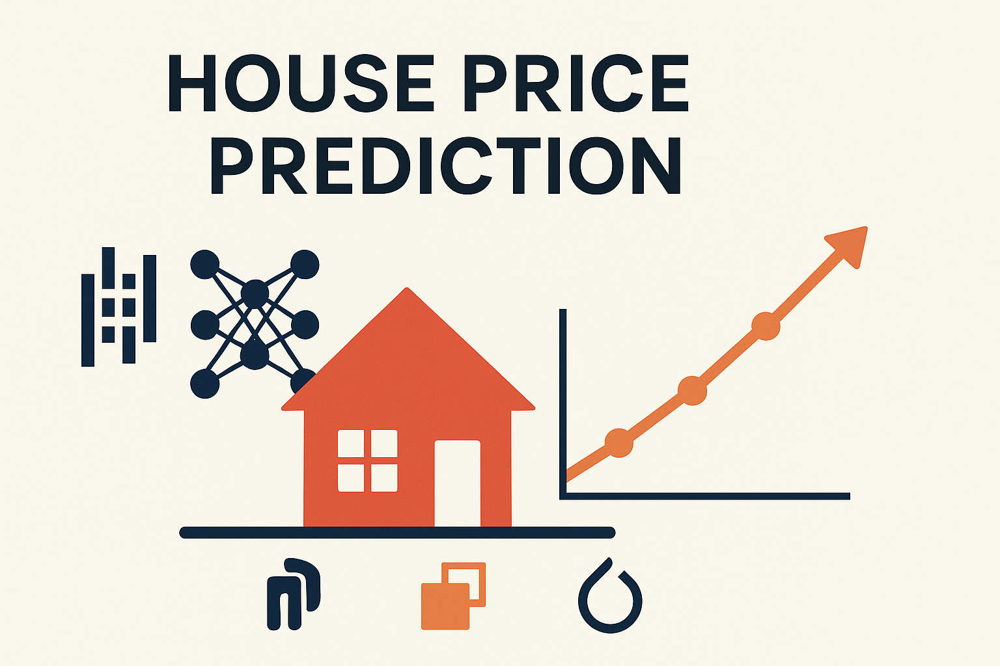
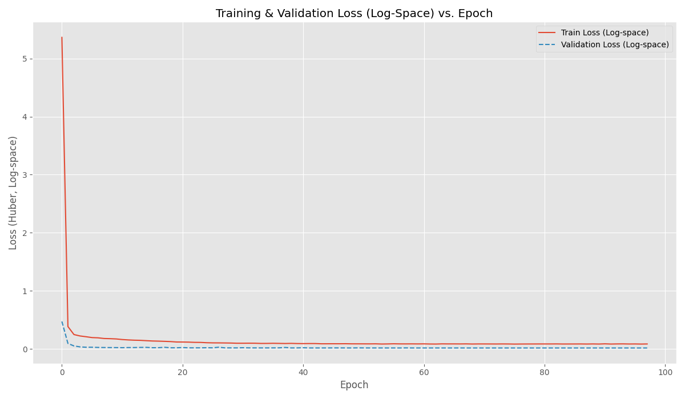
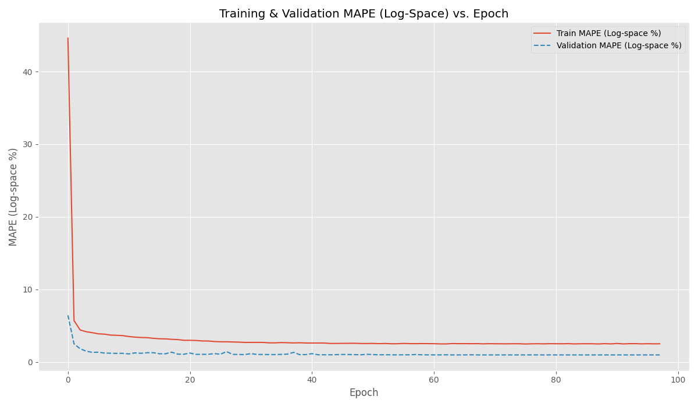
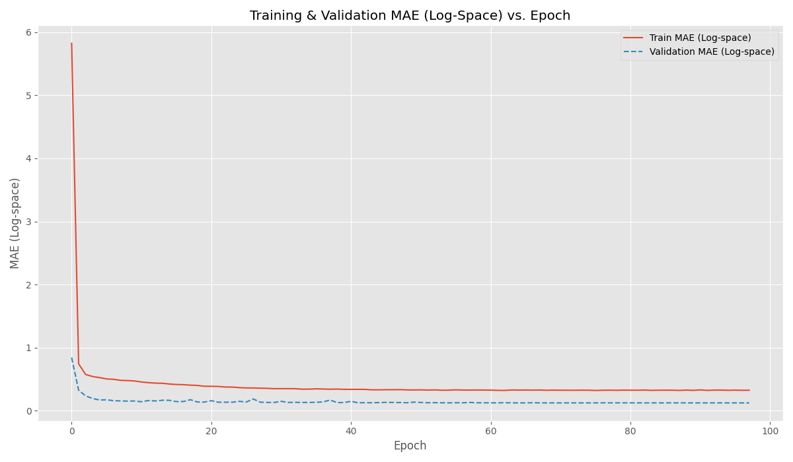
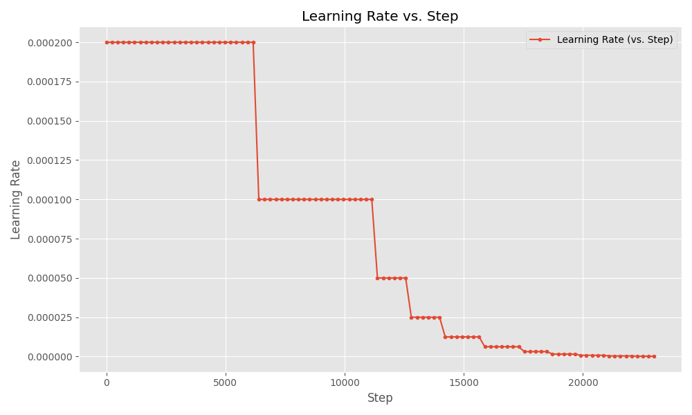

# 🏠 King County House Price Prediction with MLP & Optuna Optimization

[](https://www.python.org/)
[](https://pytorch.org/)
[]()
[-orange?logo=kaggle)](https://www.kaggle.com/datasets/harlfoxem/housesalesprediction)


[](LICENSE)

A deep learning project that predicts King County house prices with only **12.4% MAPE**, using a custom Multi-Layer Perceptron (MLP), PyTorch Lightning, and Optuna. This project demonstrates real-world regression modeling, extensive feature engineering, and advanced training workflows — ideal for showcasing applied machine learning skills.

---

## 📌 Table of Contents

- [� King County House Price Prediction with MLP \& Optuna Optimization](#-king-county-house-price-prediction-with-mlp--optuna-optimization)
  - [📌 Table of Contents](#-table-of-contents)
  - [🎯 Project Objective](#-project-objective)
  - [📂 Dataset](#-dataset)
  - [🔧 Methodology \& Pipeline](#-methodology--pipeline)
    - [🧹 Data Exploration \& Preprocessing](#-data-exploration--preprocessing)
    - [🧠 Model Architecture](#-model-architecture)
    - [⚙️ Training Process](#️-training-process)
    - [📈 Hyperparameter Optimization](#-hyperparameter-optimization)
  - [✅ Results \& Performance](#-results--performance)
    - [📉 Journey to High Accuracy](#-journey-to-high-accuracy)
    - [📊 Final Test Set Performance](#-final-test-set-performance)
    - [🔍 Best Hyperparameters Found](#-best-hyperparameters-found)
  - [Visualizations](#visualizations)
  - [Tools and Technologies](#tools-and-technologies)
  - [🚀 How to Run](#-how-to-run)
  - [File Structure](#file-structure)

---

## 🎯 Project Objective

The primary goal of this project was to develop a robust deep learning model capable of accurately predicting house sale prices in King County. Key objectives included:

- Performing thorough data cleaning, feature engineering, and preprocessing.
- Implementing and training an MLP model using PyTorch and PyTorch Lightning.
- Optimizing model hyperparameters using Optuna to achieve the best predictive performance.
- Demonstrating a significant reduction in prediction error (MAPE/MAE) from baseline models.

---

## 📂 Dataset

The project utilizes the **King County House Sales dataset** (`kc_house_data.csv`). This dataset contains historical data of houses sold between May 2014 and May 2015. Key features include:

- Date of sale  
- Bedrooms, bathrooms, floors  
- Square footage (living, lot, above, basement)  
- Condition, grade, view, waterfront status  
- Year built, year renovated  
- Zipcode, latitude, longitude  
- `sqft_living15`, `sqft_lot15` (average sqft of 15 nearest neighbors)

---

## 🔧 Methodology & Pipeline

### 🧹 Data Exploration & Preprocessing

- **Removed unnecessary columns:** `id`, `date`
- **Created time-based features:** `sale_year`, `sale_month`, `sale_dayofyear`
- **Engineered renovation features:** `was_renovated`, `yrs_since_renovation`, `effective_age`
- **Added boolean and ratio features:** e.g., `has_basement`, `sqft_living_per_bedroom`, `bathrooms_per_bedroom`
- **Transformed target variable:** `price_log = np.log1p(price)`
- **Encoded categorical variables:** One-hot encoded `zipcode`
- **Scaled numerical features:** Used `StandardScaler`

### 🧠 Model Architecture

- Input layer based on number of features
- Multiple hidden layers (with GELU and Dropout)
- Output: Single neuron for `price_log` regression

> **Note:** Final predictions are `np.expm1(model output)` to revert log transformation.

### ⚙️ Training Process

- **Loss Function:** Huber Loss
- **Optimizer:** Adam
- **Scheduler:** ReduceLROnPlateau
- **Callbacks:**
  - EarlyStopping (val loss)
  - ModelCheckpoint (best model)
  - LearningRateMonitor
  - CSVLogger

### 📈 Hyperparameter Optimization

Used **Optuna** with 100 trials to tune:

- `num_layers`, `hidden_units`, `dropout`
- `learning_rate`, `weight_decay`
- Scheduler: `patience`, `factor`

---

## ✅ Results & Performance

### 📉 Journey to High Accuracy

| Model Version            | MAPE        |
|--------------------------|-------------|
| Baseline (no tuning)     | >30%        |
| With preprocessing       | ~20%        |
| After Optuna tuning      | **~12.4%**  |

### 📊 Final Test Set Performance

| Metric       | Value          |
|--------------|----------------|
| **MAPE**     | **~12.4%**     |
| **MAE**      | **~$69,217**   |
| **Test Loss**| **~0.014**     |

### 🔍 Best Hyperparameters Found

- `num_layers`: *2*
- `hidden_units`: *192*
- `dropout`: *0.13*
- `lr`: *2e-4*
- `weight_decay`: *1e-4*
- `lr_scheduler_patience`: *4*
- `lr_scheduler_factor`: *0.5*

## Visualizations

- Training, Validation Loss curves.

- Training, Validation MAPE/MAE curves.


- LR change based on the scheduler


## Tools and Technologies

- Python 3.x
- Pandas: For data manipulation and analysis.
- NumPy: For numerical operations.
- Scikit-learn: For preprocessing (StandardScaler).
- PyTorch: For building the neural network.
- PyTorch Lightning: For structuring PyTorch code and streamlining training.
- Optuna: For hyperparameter optimization.
- Matplotlib / Seaborn: For plotting results.
- Jupyter Notebooks (Optional, for EDA).
- Git & GitHub: For version control and project showcase.

---

## 🚀 How to Run

1. Clone the repo

```bash
git clone https://github.com/your-username/kc-house-price-mlp.git
cd kc-house-price-mlp
```

2. Install dependencies

```bash
pip install -r requirements.txt
```

3. Preprocess data

```bash
python src/preprocess.py
```

4. Run hyperparameter search

```bash
python src/objective_optuna.py
```

5. Train final model

```bash
python src/train_final_model.py
```
6. Plot results

```bash
python src/plot_results.py
```

---

## File Structure

├── data/
│   └── kc_house_data.csv         # Original dataset
│   └── kc_house_data_preprocessed.csv # Preprocessed dataset
├── notebooks/
│   └── kc_house_price.ipynb
├── assets/
│   └── header.png
├── src/
│   ├── preprocess.py             # Script for data preprocessing
│   ├── data_utils.py             # Script for prepearing the for Datasets and DataLoaders (using Torch Lightning)
│   ├── model.py                  # PyTorch Lightning Model (KcHousePrices)
│   ├── objective_optuna.py       # Optuna objective function and code to perform trials
│   ├── train_final_model.py      # Script to train with best hyperparameters
│   └── plot_results.py           # Script to plot logged metrics
├── results/
│   ├── best_model.ckpt           # Saved best model checkpoint
│   ├── loss_plot.png
│   └── mape_plot.png
│   └── mae_plot.png
│   └── lr_plot.png
├── lightning_logs/               # Logs from CSVLogger /
│   └── kc_house_mlp_final_run_X/
│       └── version_X/
│           └── train_los.csv/
│               ├── metrics.csv
│               └── hparams.yaml
├── .gitignore
├── LICENSE
├── README.md
└── requirements.txt
